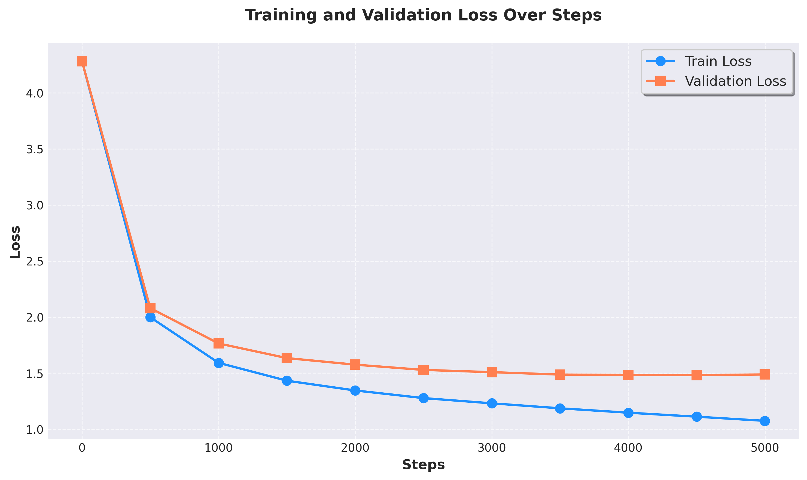

# Transformer based Language Model
This project implements a Transformer-based Language Model from scratch using PyTorch. The model is trained on the TinyShakespeare dataset and is capable of generating text in the style of Shakespeare. 

# Features

**Transformer Architecture**: Implements multi-head self-attention, feed-forward layers, and layer normalization.

**Character-Level Modeling**: The model operates at the character level, making it simple and interpretable.

**Training Loop**: Includes a training loop with AdamW optimizer, evaluation on validation data, and text generation.

**Checkpointing**: Saves the model architecture, weights, and tokenizer for later use.

# Requirements

Python 3.7+

PyTorch 1.10+

CUDA (optional, for GPU acceleration)

After set up the environment, run command 
```
python model.py data/input.txt
```




**This project utilizes the Transformer architecture, as introduced in the paper**: Attention is All You Need


The Transformer model revolutionized natural language processing (NLP) by replacing recurrent layers with self-attention mechanisms, enabling parallelization and improved performance on sequence-to-sequence tasks. For more details, refer to the [original paper](https://arxiv.org/pdf/1706.03762).
